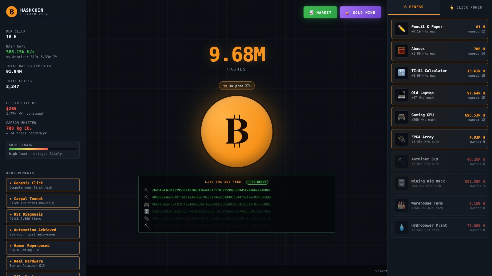

# hashcoin clicker

cookie clicker but for actual bitcoin mining. you click a button, you buy ridiculous mining hardware, your co2 emissions go up.

→ **[play it](https://ewoudvv.github.io/hashcoin-clicker-game/)**

## stuff in it

- 16 tiers of miners, from pencil & paper to a literal dyson swarm
- 10 click upgrades (mechanical keyboard → multiverse clicker)
- random events: FBI raids, china banning crypto for the 47th time, bull runs, datacenter fires
- clickable popup bonuses (🍕 laszlo's pizza, 🐋 whale spotted, 💎 diamond hands)
- a solo-mine minigame that actually computes SHA-256
- a fake HSHC stock market with a live chart, reacts to in-game news
- click crits (1% for 10×, 0.1% for 100× mega crits)
- a grid strain meter that triggers brownouts when you push too hard
- 27 achievements
- 3 hidden easter eggs (good luck)
- a news ticker that knows what you've built

## tech

one html file. no build step, no dependencies. real SHA-256 via the web crypto api. saves to localStorage.

## why

dumb side project.
